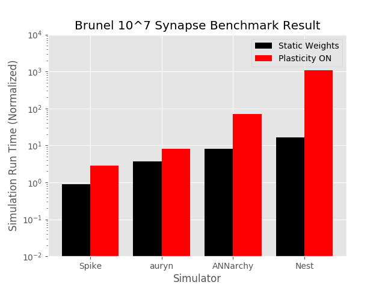

# SNNSimulatorComparison
Comparison of Spiking Neural Network Simulator Performance

__Note: Tests are still being conducted on the benchmark model for each simulator and the results may change as the models are corrected__

Simulators are included as git submodules.
Currently the simulators being compared are:
- [NEST Simulator (using pyNEST)](https://github.com/nest/nest-simulator/)
- [Brian Simulator (v2)](https://github.com/brian-team/brian2)
- [Auryn](https://github.com/fzenke/auryn)
- [ANNarchy](https://github.com/ANNarchy/ANNarchy)
- [Spike](https://github.com/nasiryahm/Spike)

## Results
### Vogels Abbott Benchmark
Source Paper:
Vogels TP, Abbott LF. Signal propagation and logic gating in networks of integrate-and-fire neurons. J Neurosci. 2005;25: 10786–10795.

Simulations were all single-threaded and run on machine with:
CPU: Intel i7-4770K
GPU: NVIDIA GTX 1070 founders edition
OS: Ubuntu 16.04 LTS

All simulations load the same set of weights (ee/ei/ie/ii.wmat located in the benchmark folder) and therefore allow a direct simulation comparison. This benchmark simulation was inspired by the benchmarks used for the [Auryn](https://github.com/fzenke/auryn) simulator. See their github repository for further details.

The installed python (conda) environment details are located in the conda\_req.txt file.

Results of a simulation of the VogelsAbbott Benchmark with ALL synaptic delays set to 0.1ms


Results of a simulation of the VogelsAbbott Benchmark with ALL synaptic delays set to 0.8ms


A comparison of the ISI distributions, firing rasters, and firing rates is present in an [iPython notebook](Benchmarks/VogelsAbbott/_results/SimulatorComparisons.ipynb). These results were produced from files which are automatically dumped when the "--fast" option is not used in simulation execution.

### Brunel 10,000 Neuron / 10^7 Synapse Plastic Network
Source Paper:
Brunel N. Dynamics of sparsely connected networks of excitatory and inhibitory spiking neurons. J Comput Neurosci. 2000;8: 183–208.

The model implemented is a specific version of this network as implemented by the auryn and ANNarchy networks (see repositories).

Results of a simulation of the Brunel10K Benchmark with and without synaptic plasticity


## Getting all submodules:
In order to clone this repository with all submodules:
```
git clone --recurse-submodules -j8 https://github.com/nasiryahm/SNNSimulatorComparison.git
```

## Installation
Spike, Auryn and Nest are auto compiled (using make). Ensure that the dependencies for these libraries are pre-installed. To see these, please visit the github pages for these projects.

ANNarchy and Brian can be installed using `pip install Simulators/ANNarchy/` and `pip install Simulators/brian2` from this location. Again, ensure that the dependencies are pre-installed.
The dependencies and packages required for the installation of these two packages can be found in the requirements.txt file in the root of this repo.

## Running a speed test
VogelsAbbotBenchmark.sh and Brunel10KBenchmark.sh are bash scripts that outlines the simulation length and delay style to simulate in each simulator.
This will produce a timefile.dat file in each folder under "Benchmarks/BENCHMARK/SIMULATOR". This timefile.dat contains a single ASCII float which is the time required to run the simulation (simulation run time only, not for the rest of the script).
The "Benchmarks/VogelsAbbott/\_results" folder contains a plotting.py file with the matplotlib commands used to produce the results plots.

The benchmark bash scripts expect the existence of a conda environment (with packages listed in requirements.txt) of the name "simulatorcomparison".

## Testing ranges of delays:
Spike, Brian2, and Nest support ranges of delays. ANNarchy informs us that it can handle uniform delays (experimentally) though does not compile in this case.

Auryn does not currently support ranges of delays.
