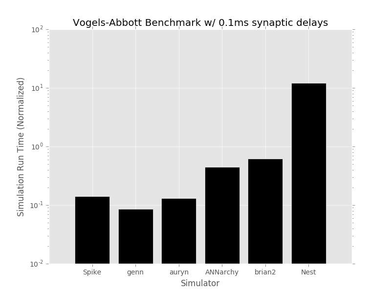

# SNNSimulatorComparison
Comparison of Spiking Neural Network Simulator Performance

Simulators are included as git submodules.
Currently the simulators being compared are:
- [NEST Simulator (using pyNEST)](https://github.com/nest/nest-simulator/)
- [Brian Simulator (v2)](https://github.com/brian-team/brian2)
- [Auryn](https://github.com/fzenke/auryn)
- [ANNarchy](https://github.com/ANNarchy/ANNarchy)
- [Spike](https://github.com/nasiryahm/Spike)
- [Brian2 with GeNN (General Neural Network Simulator)](https://github.com/brian-team/brian2genn)

## Results
Simulations were all single-threaded and run on machine with:
CPU: Intel i7-4770K
GPU: NVIDIA GTX 1070 founders edition

Results of a simulation of the VogelsAbbott Benchmark with all synaptic delays set to 0.1ms

Results of a simulation of the VogelsAbbott Benchmark with all synaptic delays set to 0.8ms

## Getting all submodules:
In order to clone this repository with all submodules:
git clone --recurse-submodules -j8 https://github.com/nasiryahm/SNNSimulatorComparison.git

## Installation
Spike, Auryn and Nest are auto compiled (using make). Ensure that the dependencies for these libraries are pre-installed. To see these, please visit the github pages for these projects.

ANNarchy and Brian can be installed using 'pip install Simulators/ANNarchy/' and 'pip install Simulators/brian2' from this location. Again, ensure that the dependencies are pre-installed.
The dependencies and packages required for the installation of these two packages can be found in the requirements.txt file in the root of this repo.

Brian with GeNN must be installed separately. If using conda, 'conda install -c brian-team brian2genn'. Otherwise, you must set the CUDA\_PATH and GENN\_PATH variables and add ${GENN\_PATH}/lib/bin to PATH. Following this, it can be installed as above with pip: 'pip install Simulators/brian2genn'

## Running a speed test
"run_benchmark.sh" is a bash script that outlines the simulation length and delay style to simulate in each simulator. Edit this to run a given style of benchmark (at the moment VogelsAbbott benchmark only). This will produce a timefile.dat file in each folder under "Benchmarks/VogelsAbbott/SIMULATOR". This timefile.dat contains a single ASCII float which is the time required to run the simulation (simulation run time only, not for the rest of the script). The "Benchmarks/VogelsAbbott/\_results" folder contains a plotting.py file with the matplotlib commands used to produce the results plots.

## Testing ranges of delays:
Spike, Brian2, and Nest support ranges of delays. ANNarchy informs us that it can handle uniform delays (experimentally) though does not compile in this case.

Auryn and Brian2GeNN do not seem to support ranges of delays.
