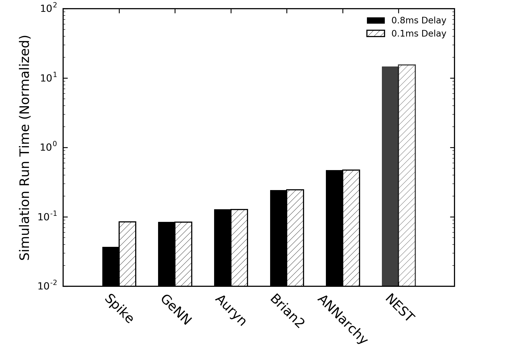
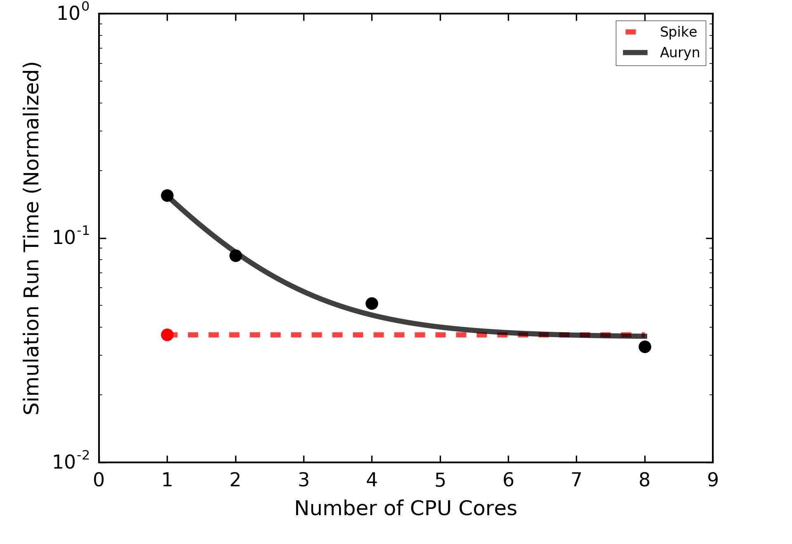
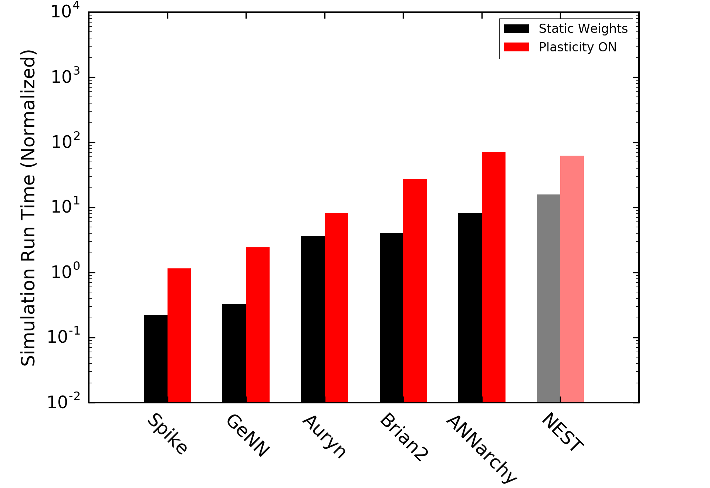

# SNNSimulatorComparison
Comparison of Spiking Neural Network Simulator Performance. See our pre-print presenting these results in detail;
[Spike: A GPU Optimised Spiking Neural Network Simulator](https://www.biorxiv.org/content/early/2018/11/06/461160)

Simulators are included as git submodules.
Currently the simulators being compared are:
- [NEST Simulator (using pyNEST)](https://github.com/nest/nest-simulator/)
- [Brian Simulator (v2)](https://github.com/brian-team/brian2)
- [Auryn](https://github.com/fzenke/auryn)
- [ANNarchy](https://github.com/ANNarchy/ANNarchy)
- [GeNN](https://github.com/genn-team/genn)
- [Spike](https://github.com/nasiryahm/Spike)

In order to clone the repository AND all of the specific simulator versions used, please run;

```
git clone --recurse-submodules https://github.com/nasiryahm/SNNSimulatorComparison
```

## Results
### Vogels Abbott Benchmark
Source Paper:
Vogels TP, Abbott LF. Signal propagation and logic gating in networks of integrate-and-fire neurons. J Neurosci. 2005;25: 10786–10795.

Simulations were all single-threaded and run on machine with:
CPU: Intel i7-4770K
GPU: NVIDIA GTX 1070 founders edition
OS: Ubuntu 16.04 LTS

All simulations load the same set of weights (ee/ei/ie/ii.wmat which are expected to be located in the Benchmark folders) and therefore allow a direct simulation comparison. This benchmark simulation was inspired by the benchmarks used for the [Auryn](https://github.com/fzenke/auryn) simulator. See their github repository for further details.

The installed python (conda) environment details are located in the conda\_req.txt file.

Results of a simulation of the VogelsAbbott Benchmark with synaptic delays either all set to 0.1ms, or 0.8ms (with a simulation timestep of 0.1ms in both cases).


Note that all simulators other than NEST employ a forward euler solver to compute updates to the network dynamics, hench NEST is shown in gray.


A comparison of the ISI distributions, firing rasters, and firing rates is present in an [iPython notebook](Benchmarks/VogelsAbbott/_results/SimulatorComparisons.ipynb). These results were produced from files which are automatically dumped when the "--fast" option is not used in simulation execution.

#### Multi-threaded Comparison

Above, only Spike and Auryn are compared. Auryn is benchmarked with 1, 2, 4, and 8 threads on a system with a 16 core Intel Xeon E5-2623 v4. These benchmarks are shown as black points on the plot above. An exponential decay curve is fit to the Auryn datapoints as shown in black. For comparison, the single-threaded, single-GPU speed of Spike is shown in red.

### Brunel 10,000 Neuron / 10^7 Synapse Plastic Network
Source Paper:
Brunel N. Dynamics of sparsely connected networks of excitatory and inhibitory spiking neurons. J Comput Neurosci. 2000;8: 183–208.

The model implemented is a specific version of this network as implemented by the Auryn and ANNarchy networks (see repositories).

Results of a simulation of the Brunel10K Benchmark with and without synaptic plasticity


## Installation
Spike, Auryn and NEST simulator are auto compiled (using make). Ensure that the dependencies for these libraries are pre-installed. To see these, please visit the github pages for these projects.

ANNarchy and Brian can be installed using `pip install Simulators/ANNarchy/` and `pip install Simulators/brian2` from this location. Again, ensure that the dependencies are pre-installed.
The dependencies and packages required for the installation of these two packages can be found in the requirements.txt file in the root of this repo.

## Running a speed test
After installing/compiling the simulators (located in the Simulators folder), the models can be compiled as necessary in the Benchmarks folder.
Examples of how to compile Spike, Auryn, and GeNN models are given as "compile.sh" bash scripts.
Each model has a few key command line arguments which can be used in order to set the behaviour;

Setting the number of seconds (X) for which the simulation will run;
```
--simtime X
```

A boolean which will ensure that any spike recording is turned off and the model execution is timed;
```
--fast
```

## Testing ranges of delays:
Spike, Brian2, and NEST simulator support ranges of delays. 

ANNarchy informs us that it can handle uniform delays (experimentally) though does not compile in this case. Auryn and GeNN do not currently support ranges of delays within a single synaptic population.
